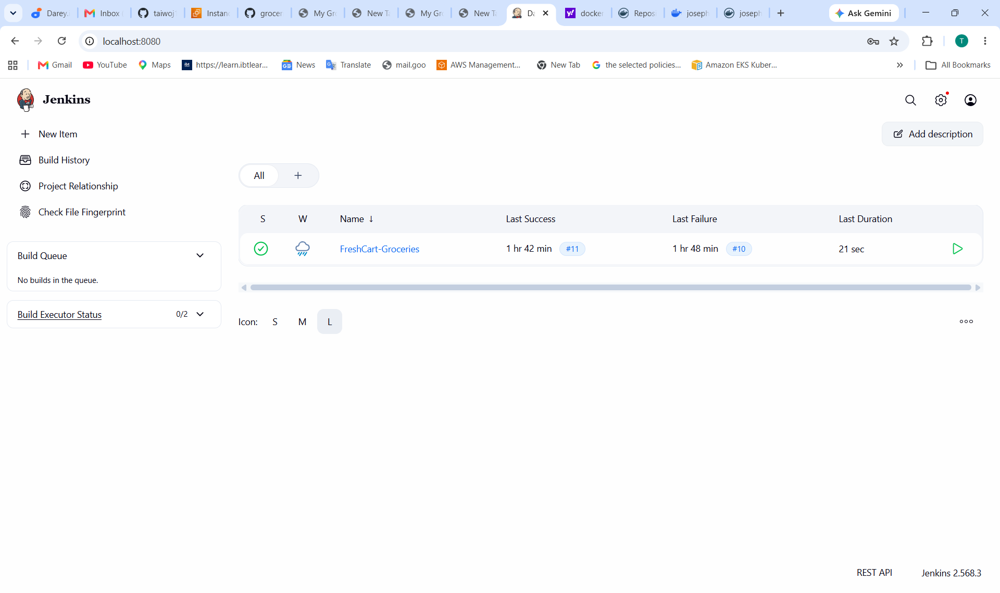
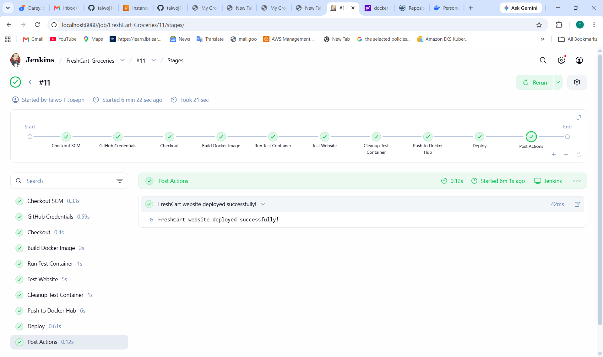

#    Groceries Web Application — Jenkins CI/CD Pipeline

##   Project Overview

This project demonstrates how to automate the build, testing, and deployment of a simple **Groceries web application** using **Jenkins**, **Docker**, and **GitHub**.

The application is a lightweight HTML-based grocery website served using **Nginx inside a Docker container**.

Jenkins is used to automate the software delivery workflow whenever changes are pushed to the GitHub repository.

### Project Goals

The main objectives of this project are to:

* Store application source code in GitHub.
* Build the application into a Docker image.
* Automatically test the Docker container.
* Verify that the web application is accessible.
* Clean up the test container.
* Deploy the application using Docker.
* Demonstrate a complete Jenkins pipeline.
* Document the Jenkins configuration and pipeline stages.
* Provide visual evidence of successful pipeline execution.

---

#   Architecture

The overall workflow is:

```text
Developer
    │
    │ git push
    ▼
GitHub Repository
    │
    │ Jenkins detects change
    ▼
Jenkins
    │
    ├── Checkout
    │
    ├── Build Docker Image
    │
    ├── Run Test Container
    │
    ├── Test Application
    │
    ├── Cleanup Test Container
    │
    └── Deploy
             │
             ▼
       Docker Container
             │
             ▼
        Nginx Web Server
             │
             ▼
       Groceries Website
```

---

#   Project Structure

The project has the following structure:

```text
groceries/
│
├── Dockerfile
├── Jenkinsfile
├── README.md
|── index.html

```

### File Descriptions

| File          | Description                                |
| ------------- | ------------------------------------------ |
| `index.html`  | Main groceries web application             |
| `Dockerfile`  | Instructions for building the Docker image |
| `Jenkinsfile` | Jenkins Declarative Pipeline definition    |
| `README.md`   | Project and pipeline documentation         |

---

#   GitHub Repository

The application source code and Jenkins pipeline definition are stored in GitHub.

**GitHub Repository:**

https://github.com/taiwoj14/groceries-jenkins.git

The repository contains:

* Application source code
* Dockerfile
* Jenkinsfile
* README documentation

---

#   Docker Configuration

The application is packaged as a Docker image.

A typical Dockerfile used for this project is:

```dockerfile
FROM ubuntu:24.04

RUN apt-get update && \
    apt-get install -y nginx && \
    apt-get clean && \
    rm -rf /var/lib/apt/lists/*

COPY index.html /var/www/html/index.html

EXPOSE 80

CMD ["nginx", "-g", "daemon off;"]
```

## Dockerfile Explanation

### Base Image

```dockerfile
FROM ubuntu:24.04
```

Uses Ubuntu 24.04 as the base operating system.

### Install Nginx

```dockerfile
RUN apt-get update && \
    apt-get install -y nginx
```

Installs Nginx, which is used to serve the HTML application.

### Copy Application

```dockerfile
COPY index.html /var/www/html/index.html
```

Copies the groceries application into Nginx's default web directory.

### Expose Port

```dockerfile
EXPOSE 80
```

Documents that Nginx listens on port 80 inside the container.

### Start Nginx

```dockerfile
CMD ["nginx", "-g", "daemon off;"]
```

Runs Nginx in the foreground so Docker can keep the container running.

---

#   Jenkins Setup

## 1. Jenkins Installation

Jenkins is installed on an Ubuntu-based environment and accessed through a web browser.

The Jenkins service can be checked using:

```bash
sudo systemctl status jenkins
```

If Jenkins is not running:

```bash
sudo systemctl start jenkins
```

To enable Jenkins to start automatically:

```bash
sudo systemctl enable jenkins
```

---

#   Jenkins Credentials

Jenkins credentials are used to securely authenticate with external services.

The project uses GitHub and Docker Hub credentials where required.

## GitHub Credential

A Jenkins credential is configured for GitHub authentication.

Example credential ID:

```text
github-token
```

The credential can be created from:

```text
Jenkins
→ Manage Jenkins
→ Credentials
→ System
→ Global credentials
→ Add Credentials
```

For a GitHub Personal Access Token, the credential should be stored securely rather than hard-coded inside the Jenkinsfile.

---

## Docker Hub Credential

A Docker Hub credential can also be configured in Jenkins.

Example credential ID:

```text
dockerhub-credentials
```

The credential is used when Jenkins needs to authenticate with Docker Hub.

Credentials should **never be placed directly inside the Jenkinsfile**.

---

#   Jenkins Plugins

The following Jenkins plugins are relevant to this project.

| Plugin               | Purpose                                          |
| -------------------- | ------------------------------------------------ |
| Pipeline             | Provides Jenkins Pipeline functionality          |
| Pipeline: Stage View | Displays pipeline stages visually                |
| Git                  | Allows Jenkins to interact with Git repositories |
| GitHub               | Provides GitHub integration                      |
| Credentials Binding  | Securely exposes credentials to pipeline steps   |
| Docker Pipeline      | Provides Docker-related pipeline functionality   |
| Docker               | Supports Docker integration                      |
| GitHub API           | Supports GitHub communication                    |
| Workspace Cleanup    | Helps clean Jenkins workspaces                   |

Plugin availability may vary depending on the Jenkins installation.

Plugins can be managed from:

```text
Jenkins
→ Manage Jenkins
→ Plugins
```

---

#   Jenkins Pipeline

The pipeline is defined using a `Jenkinsfile`.

The Jenkinsfile uses **Declarative Pipeline syntax**.

The pipeline automates the following workflow:

```text
Checkout
   ↓
Build Docker Image
   ↓
Run Test Container
   ↓
Test Application
   ↓
Cleanup Test Container
   ↓
Deploy
```

---

#   Pipeline Stages

## Stage 1 — Checkout

The Checkout stage retrieves the application source code from GitHub.

Example:

```groovy
stage('Checkout') {
    steps {
        checkout scm
    }
}
```

### Purpose

This stage ensures that Jenkins works with the latest version of the application source code.

---

#   Stage 2 — Build Docker Image

The Build stage creates a Docker image from the Dockerfile.

Example:

```groovy
stage('Build Docker Image') {
    steps {
        sh 'docker build -t ${IMAGE_NAME}:latest .'
    }
}
```

The resulting image is tagged:

```text
groceries:latest
```

### Purpose

This stage verifies that the application can be successfully packaged into a Docker image.

---

#   Stage 3 — Run Test Container

Jenkins starts a temporary Docker container from the newly created image.

Example:

```groovy
stage('Run Test Container') {
    steps {
        sh '''
            docker rm -f groceries-web 2>/dev/null || true
            docker run -d --name groceries-web -p 8083:80 ${IMAGE_NAME}:latest
        '''
    }
}
```

### Purpose

This stage verifies that the Docker image can successfully start as a running container.

The host port can be changed if another application is already using the port.

For example:

```text
Host: 8083
Container: 80
```

---

#   Stage 4 — Test Application

The application is tested using `curl`.

Example:

```groovy
stage('Test Application') {
    steps {
        sh '''
            sleep 5
            curl -f http://localhost:8083
        '''
    }
}
```

The `-f` option causes `curl` to return a failure if the HTTP request receives an unsuccessful response.

### What This Test Verifies

The test verifies that:

1. The container is running.
2. Nginx is running.
3. Port mapping is working.
4. The application is accessible.
5. The web server returns a successful HTTP response.

A successful test should produce output similar to:

```text
HTTP/1.1 200 OK
```

---

#   Stage 5 — Cleanup Test Container

After testing, Jenkins removes the temporary test container.

Example:

```groovy
stage('Cleanup Test Container') {
    steps {
        sh '''
            docker rm -f groceries-web 2>/dev/null || true
        '''
    }
}
```

### Purpose

Cleanup prevents old test containers from consuming system resources or causing port conflicts during future pipeline executions.

---

#   Stage 6 — Deploy

The Deploy stage starts the application container for actual use.

Example:

```groovy
stage('Deploy') {
    steps {
        sh '''
            docker rm -f groceries-webapps 2>/dev/null || true
            docker run -d \
                --name groceries-webapps \
                -p 8083:80 \
                ${IMAGE_NAME}:latest
        '''
    }
}
```

The application can then be accessed through:

```text
http://<server-ip>:8083
```

If Jenkins and Docker are running on the local computer, the application can be accessed using:

```text
http://localhost:8083
```

---

#   Example Jenkinsfile

The following is an example of the pipeline structure used by this project:

```groovy
pipeline {
    agent any

    environment {
        IMAGE_NAME = "groceries"
        CONTAINER_NAME = "groceries-webapps"
    }

    stages {

        stage('Checkout') {
            steps {
                checkout scm
            }
        }

        stage('Build Docker Image') {
            steps {
                sh 'docker build -t ${IMAGE_NAME}:latest .'
            }
        }

        stage('Run Test Container') {
            steps {
                sh '''
                    docker rm -f groceries-web 2>/dev/null || true
                    docker run -d \
                        --name groceries-web \
                        -p 8083:80 \
                        ${IMAGE_NAME}:latest
                '''
            }
        }

        stage('Test Application') {
            steps {
                sh '''
                    sleep 5
                    curl -f http://localhost:8083
                '''
            }
        }

        stage('Cleanup Test Container') {
            steps {
                sh '''
                    docker rm -f groceries-web 2>/dev/null || true
                '''
            }
        }

        stage('Deploy') {
            steps {
                sh '''
                    docker rm -f ${CONTAINER_NAME} 2>/dev/null || true

                    docker run -d \
                        --name ${CONTAINER_NAME} \
                        -p 8083:80 \
                        ${IMAGE_NAME}:latest
                '''
            }
        }
    }

    post {
        success {
            echo 'Pipeline completed successfully.'
        }

        failure {
            echo 'Pipeline failed. Check the Jenkins console output.'
        }
    }
}
```

> **Note:** The Jenkinsfile in the GitHub repository is the source of truth. The example above documents the intended pipeline structure and should be kept synchronized with the actual Jenkinsfile.

---

#   Creating the Jenkins Pipeline Job

## Step 1 — Open Jenkins

Open the Jenkins web interface.

Example:

```text
http://localhost:8080
```

or the address of the Jenkins server.

---

## Step 2 — Create a New Item

From the Jenkins dashboard:

```text
New Item
```

Enter a name such as:

```text
FreshCart-Groceries
```

Select:

```text
Pipeline
```

Click:

```text
OK
```

---

#   Configure GitHub Repository

Inside the Jenkins Pipeline configuration:

Go to:

```text
Pipeline
```

Select:

```text
Pipeline script from SCM
```

Select:

```text
Git
```

Repository URL:

```text
https://github.com/taiwoj14/groceries-jenkins.git
```

Branch:

```text
*/main
```

Script Path:

```text
Jenkinsfile
```

Save the configuration.

---

#    Running the Pipeline

From the Jenkins job page:

```text
Build Now
```

Jenkins will execute the stages in order.

The expected sequence is:

```text
Checkout
   ✓

Build Docker Image
   ✓

Run Test Container
   ✓

Test Application
   ✓

Cleanup Test Container
   ✓

Deploy
   ✓
```

---

#   Jenkins Stage View

A successful execution should display all pipeline stages in Jenkins.

Example:

```text
┌──────────┬────────────────────┬───────────────────┬──────────────────┬────────────────────────┬────────┐
│ Checkout │ Build Docker Image │ Run Test Container│ Test Application │ Cleanup Test Container │ Deploy │
├──────────┼────────────────────┼───────────────────┼──────────────────┼────────────────────────┼────────┤
│    ✓     │         ✓          │         ✓         │        ✓         │           ✓            │   ✓  │
└──────────┴────────────────────┴───────────────────┴──────────────────┴────────────────────────┴────────┘
```

---

#   Screenshots / Evidence

Screenshots provide visual evidence that the Jenkins pipeline was successfully configured and executed.

Add the following screenshots to the project documentation.

## Screenshot 1 — Jenkins Pipeline Dashboard

Show:

* Jenkins job name
* Build number
* Build status
* Pipeline stages

Suggested file:

```text
screenshots/jenkins-pipeline-success.png
```

Example Markdown:

```markdown

```

---

## Screenshot 2 — Successful Build

Show the Jenkins build page displaying a successful build.

Suggested file:

```text
screenshots/jenkins-build-success.png
```

```markdown

```

---

## Screenshot 3 — Console Output

Show the Jenkins Console Output demonstrating:

* Git checkout
* Docker build
* Container startup
* Application test
* Cleanup
* Deployment
* Successful completion

Suggested file:

```text
screenshots/jenkins-console-output.png
```

```markdown

```

---

## Screenshot 4 — Running Docker Container

Show:

```bash
docker ps
```

Example:

```text
CONTAINER ID   IMAGE              STATUS        PORTS
xxxxxxxxxxxx   groceries:latest   Up ...        0.0.0.0:8083->80/tcp
```

Suggested file:

```text
screenshots/docker-container.png
```

```markdown

```

---

## Screenshot 5 — Application in Browser

Show the running Groceries application in the browser.

Example:


```text
http://localhost:8083
```

Suggested file:

```text
screenshots/groceries-application.png
```

```markdown

```

---

#   Manual Testing

Before relying on Jenkins, the Docker image can be tested manually.

## Build the Image

```bash
docker build -t groceries:latest .
```

Verify:

```bash
docker images
```

---

## Run the Container

```bash
docker run -d \
    --name groceries-webapps \
    -p 8083:80 \
    groceries:latest
```

Check:

```bash
docker ps
```

---

## Test with curl

```bash
curl -f http://localhost:8083
```

A successful HTTP response confirms that the web application is accessible.

---

## Test in Browser

Open:

```text
http://localhost:8083
```

The Groceries web application should be displayed.

---

#   Stop and Remove the Container

```bash
docker rm -f groceries-webapps
```

---

#   Useful Docker Commands

### List Running Containers

```bash
docker ps
```

### List All Containers

```bash
docker ps -a
```

### List Docker Images

```bash
docker images
```

### View Container Logs

```bash
docker logs groceries-webapps
```

### Inspect a Container

```bash
docker inspect groceries-webapps
```

### Remove a Container

```bash
docker rm -f groceries-webapps
```

### Remove the Image

```bash
docker rmi groceries:latest
```

---

#   Troubleshooting

## Problem 1 — Port Already in Use

If Jenkins reports:

```text
Bind for 0.0.0.0:8083 failed:
port is already allocated
```

Check which container is using the port:

```bash
docker ps
```

You can also check the port with:

```bash
sudo ss -ltnp | grep 8083
```

Stop the conflicting container:

```bash
docker rm -f <container-name>
```

Alternatively, use another host port.

For example:

```text
8083:80
```

---

# Problem 2 — Docker Permission Denied

If Jenkins receives a Docker permission error, Jenkins may not have permission to access the Docker daemon.

Check:

```bash
docker ps
```

If Docker works for your user but not Jenkins, Jenkins may need Docker group access.

Example:

```bash
sudo usermod -aG docker jenkins
```

Restart Jenkins:

```bash
sudo systemctl restart jenkins
```

Then verify the configuration.

> Docker permissions should be configured carefully because membership in the Docker group effectively grants high privileges on the host.

---

# Problem 3 — Jenkins Cannot Clone GitHub Repository

Verify the repository URL:

```text
https://github.com/taiwoj14/groceries-jenkins.git
```

Check the branch:

```text
main
```

If the repository is private, verify that the appropriate GitHub credential has been configured in Jenkins.

---

# Problem 4 — Jenkinsfile Syntax Error

Validate that the Jenkinsfile contains valid Groovy syntax.

A common problem is accidentally including Markdown code fences inside the actual Jenkinsfile.

The Jenkinsfile **must not contain**:

```text
```

````

or:

```text
```groovy
````

Those markers belong only in documentation such as `README.md`.

The actual Jenkinsfile should begin directly with:

```groovy
pipeline {
```

---

# Problem 5 — curl Test Fails

If this command fails:

```bash
curl -f http://localhost:8083
```

check whether the container is running:

```bash
docker ps
```

Check the container logs:

```bash
docker logs groceries-webapps
```

Check the port mapping:

```bash
docker ps
```

The expected mapping should look similar to:

```text
0.0.0.0:8083->80/tcp
```

---

#   Security Considerations

The following security practices are recommended:

* Do not hard-code passwords in the Jenkinsfile.
* Do not commit GitHub Personal Access Tokens to GitHub.
* Store secrets using Jenkins Credentials.
* Use least-privilege credentials where possible.
* Do not expose Jenkins directly to the public Internet without appropriate security controls.
* Use HTTPS when exposing production services.
* Restrict unnecessary AWS/security-group ports.
* Keep Jenkins and Docker updated.
* Remove unused credentials and secrets.

---

#   CI/CD Workflow

The project demonstrates the fundamental concepts of Continuous Integration and Continuous Delivery.

## Continuous Integration

Whenever application code is updated:

```text
Developer
   ↓
Git Commit
   ↓
Git Push
   ↓
GitHub
   ↓
Jenkins
   ↓
Checkout
   ↓
Docker Build
   ↓
Application Test
```

This provides rapid feedback when changes introduce problems.

---

## Continuous Delivery / Deployment

After successful testing:

```text
Successful Test
      ↓
Cleanup
      ↓
Deploy
      ↓
Running Docker Container
      ↓
Groceries Application
```

This reduces manual deployment steps.

---

#   Complete Pipeline Flow

```text
                    ┌───────────────┐
                    │   Developer   │
                    └───────┬───────┘
                            │
                       git push
                            │
                            ▼
                    ┌───────────────┐
                    │    GitHub     │
                    └───────┬───────┘
                            │
                            ▼
                    ┌───────────────┐
                    │    Jenkins    │
                    └───────┬───────┘
                            │
                 ┌──────────▼──────────┐
                 │       Checkout      │
                 └──────────┬──────────┘
                            │
                 ┌──────────▼──────────┐
                 │   Build Docker      │
                 │       Image         │
                 └──────────┬──────────┘
                            │
                 ┌──────────▼──────────┐
                 │  Run Test Container │
                 └──────────┬──────────┘
                            │
                 ┌──────────▼──────────┐
                 │  Test Application   │
                 │       curl          │
                 └──────────┬──────────┘
                            │
                 ┌──────────▼──────────┐
                 │ Cleanup Test        │
                 │ Container           │
                 └──────────┬──────────┘
                            │
                 ┌──────────▼──────────┐
                 │       Deploy        │
                 └──────────┬──────────┘
                            │
                            ▼
                    ┌───────────────┐
                    │ Docker/Nginx  │
                    │   Container   │
                    └───────┬───────┘
                            │
                            ▼
                    ┌───────────────┐
                    │   Groceries   │
                    │  Web App      │
                    └───────────────┘
```

---

#   Project Requirements Checklist

| Requirement                   | Status             |
| ----------------------------- | ------------------ |
| GitHub repository             |   ok               |
| Application source code       |   ok               |
| Dockerfile                    |   ok               |
| Jenkinsfile                   |   ok               |
| Jenkins Pipeline              |   ok               |
| GitHub integration            |   ok               |
| Docker image build            |   ok               |
| Test container                |   ok               |
| Application testing           |   ok               |
| Cleanup stage                 |   ok               |
| Deployment stage              |   ok               |
| Jenkins documentation         |   ok               |
| Plugin documentation          |   ok               |
| Pipeline stage explanation    |   ok               |
| Screenshot evidence           | Add screenshots    |
| Successful pipeline execution |   ok               |

---

#   Learning Outcomes

This project demonstrates practical experience with:

* Git and GitHub
* Jenkins
* Jenkins Declarative Pipelines
* CI/CD concepts
* Docker
* Docker image creation
* Docker containers
* Nginx
* Linux
* Bash scripting
* HTTP testing with `curl`
* Jenkins credentials
* Pipeline troubleshooting
* Application deployment
* Infrastructure and DevOps workflow automation

---

#   Future Improvements

Possible improvements include:

1. Add automated GitHub webhook triggering.
2. Push Docker images to Docker Hub.
3. Add Docker image vulnerability scanning.
4. Add automated HTML/application tests.
5. Deploy the container to AWS EC2.
6. Store the Docker image in Amazon ECR.
7. Add HTTPS using a reverse proxy and TLS.
8. Add monitoring with CloudWatch.
9. Add Prometheus and Grafana monitoring.
10. Introduce Terraform for infrastructure provisioning.
11. Implement blue/green or rolling deployments.
12. Add approval gates before production deployment.

---

#    Author

**Taiwo Joseph**


GitHub:

https://github.com/taiwoj14

---

#   Project Summary

This project demonstrates a complete automated workflow for a containerized web application.

The source code is maintained in GitHub, while Jenkins automates the process of checking out the source code, building the Docker image, running a test container, validating the application, cleaning up the test environment, and deploying the application.

The project provides practical experience with modern DevOps tools and demonstrates how automation can improve application delivery, repeatability, and reliability.

---

#   Conclusion

The Groceries Jenkins CI/CD project successfully demonstrates how Jenkins and Docker can be integrated with GitHub to automate application delivery.

The pipeline provides a repeatable workflow:

```text
GitHub
   ↓
Checkout
   ↓
Docker Build
   ↓
Container Test
   ↓
Application Test
   ↓
Cleanup
   ↓
Deployment
```

A successful Jenkins execution, together with the screenshots included in this repository, provides evidence that the pipeline has been configured and executed successfully.
